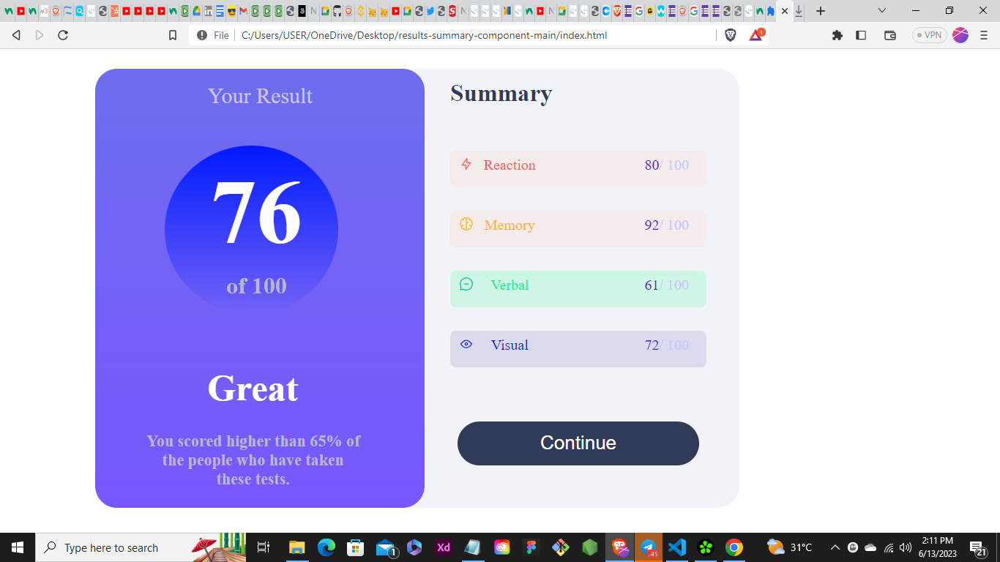

# Frontend Mentor - Results summary component solution

This is a solution to the [Results summary component challenge on Frontend Mentor](https://www.frontendmentor.io/challenges/results-summary-component-CE_K6s0maV). Frontend Mentor challenges help you improve your coding skills by building realistic projects. 


### The challenge

Users should be able to:

- View the optimal layout for the interface depending on their device's screen size
- See hover and focus states for all interactive elements on the page

### Screenshot



### Links

- Solution URL: [Add solution URL here](https://your-solution-url.com)
- Live Site URL: [Add live site URL here](https://your-live-site-url.com)


### Built with

- Semantic HTML5 markup
- CSS custom properties
- Flexbox
- CSS Grid
- Mobile-first workflow


### What I learned
I learnt more on how the box model works, Use of color and then i got to practice using Flex box

To see how you can add code snippets, see below:

```html
<h1>Some HTML code I'm proud of</h1>
```
```css
.proud-of-this-css {
  color: papayawhip;
}
```
```js
const proudOfThisFunc = () => {
  console.log('🎉')
}
```


### Continued development
i think i would need to focus more on the use of flex box so i can be perfect using it in my codes


### Useful resources

- [resource 1](https://www.frontendmentor.io) - This helped me in building projects reason. 
- [Example resource 2](https://www.W3schools.com) - This helps me when i tend to forget some stuffs and it keeps me updated


## Author

<!-- - Website - [Add your name here](https://www.your-site.com) -->
- Frontend Mentor - [@Ajibola1537](https://www.frontendmentor.io/profile/Ajibola1537)
- Twitter - [@React_JB](https://www.twitter.com/React_JB)


